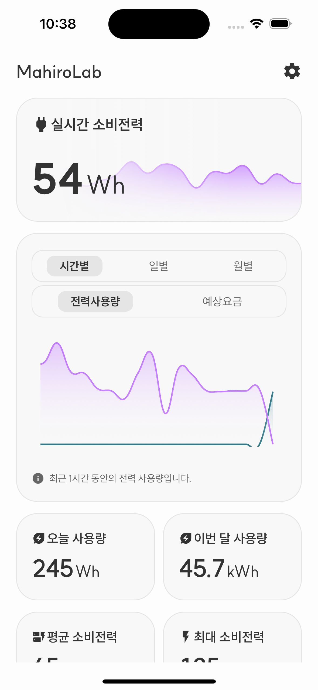
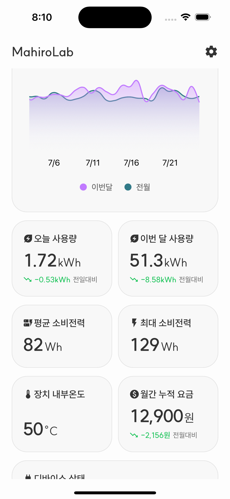

# 다원 파워매니저 AI 스마트플러그 비공식 클라이언트

이 코드를 사용하여 발생한 문제에 대해서는 책임지지 않습니다. 사용은 본인의 책임 하에 진행해주세요.

## 구현된 기능

- [백엔드](https://github.com/ny0510/Dawon-API) 연동
- 실시간 전력량 모니터링
- 전력량 통계
- 기기 온도 모니터링
- 기기 상태 조회
- 예상 전기요금 계산
- ~~기기 제어 (ON/OFF) (예정)~~
- ~~다크모드 지원 (예정)~~
- ~~다국어 지원 (예정)~~
- ~~알림 기능 (예정)~~

|  |  |
| --------------------------------------------------- | --------------------------------------------------- |
